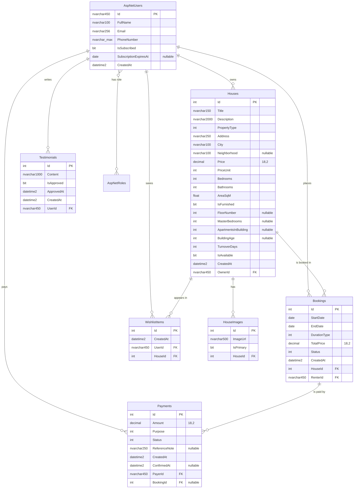

# Beytak — Database Design

Everything in this document was generated from the actual entity classes, the
`AppDbContext` configuration and the live SQL Server database, not from a written
specification.

- **Server:** SQL Server Express (`DESKTOP-V69JQA9\SQLEXPRESS`)
- **Database:** `aspnet-API-FinalProject`
- **Approach:** Entity Framework Core, Code First with migrations
- **Migrations applied:** 4

---

## 1. Approach and connection

The database is built **Code First**. Entity classes in the Domain project are the single
source of truth; the schema is generated from them by EF Core migrations. No table is
created or altered by hand.

`AppDbContext` derives from `IdentityDbContext<ApplicationUser>`, so the seven ASP.NET
Identity tables are generated alongside the six application tables.

The connection string lives in the API project's `appsettings.json` and is supplied to
Infrastructure through dependency injection:

```csharp
services.AddDbContext<AppDbContext>(o =>
    o.UseSqlServer(config.GetConnectionString("DefaultConnection")));
```

```
Server=DESKTOP-V69JQA9\SQLEXPRESS;Database=aspnet-API-FinalProject;
Trusted_Connection=True;MultipleActiveResultSets=true;TrustServerCertificate=True
```

### Migration history

| # | Migration | Purpose |
|---|---|---|
| 1 | `20260901121729_InitialCreate` | Identity tables and all six application tables, with keys, indexes and delete behaviour |
| 2 | `20260901122422_AddPropertyType` | `Houses.PropertyType` |
| 3 | `20260903145918_AddHouseDetails` | Neighbourhood, furnishing, floor, master bedrooms, apartments in building, building age; narrowed `Address` to `nvarchar(250)` |
| 4 | `20260903172127_AddTurnoverDays` | `Houses.TurnoverDays` — cleaning and inspection period between stays |

Commands used:

```
dotnet ef migrations add <Name> --project ...Infrastructure --startup-project ...API
dotnet ef database update      --project ...Infrastructure --startup-project ...API
```

---

## 2. Entity Relationship Diagram



---

## 3. Tables

The database contains **13 tables**: 7 generated by ASP.NET Identity and 6 application
tables, plus `__EFMigrationsHistory` which EF Core uses to track applied migrations.

### 3.1 `AspNetUsers` — extended by `ApplicationUser`

Inherits every Identity column (`Id`, `UserName`, `Email`, `PasswordHash`,
`PhoneNumber`, `SecurityStamp`, lockout fields and so on) and adds four:

| Column | Type | Null | Notes |
|---|---|---|---|
| `FullName` | `nvarchar(100)` | No | Display name; Identity supplies no such field |
| `IsSubscribed` | `bit` | No | Gates the ability to publish listings |
| `SubscriptionExpiresAt` | `date` | **Yes** | Null means the user has never subscribed, which is distinguishable from an expired subscription |
| `CreatedAt` | `datetime2` | No | UTC |

The primary key is `nvarchar(450)` — a GUID string supplied by Identity. Every foreign
key referencing a user therefore uses that type, not `int`.

### 3.2 `Houses`

| Column | Type | Null | Notes |
|---|---|---|---|
| `Id` | `int` IDENTITY | No | PK |
| `Title` | `nvarchar(150)` | No | |
| `Description` | `nvarchar(2000)` | No | |
| `PropertyType` | `int` | No | `PropertyType` enum |
| `Address` | `nvarchar(250)` | No | |
| `City` | `nvarchar(100)` | No | Indexed |
| `Neighborhood` | `nvarchar(100)` | Yes | |
| `Price` | `decimal(18,2)` | No | |
| `PriceUnit` | `int` | No | `DurationType` enum — the unit the price is quoted in |
| `Bedrooms` | `int` | No | |
| `Bathrooms` | `int` | No | |
| `AreaSqM` | `float` | No | A measurement, so floating point is acceptable |
| `IsFurnished` | `bit` | No | |
| `FloorNumber` | `int` | Yes | |
| `MasterBedrooms` | `int` | Yes | |
| `ApartmentsInBuilding` | `int` | Yes | |
| `BuildingAge` | `int` | Yes | `BuildingAge` enum |
| `TurnoverDays` | `int` | No | Cleaning and inspection period required between stays; defaults to 2 |
| `IsAvailable` | `bit` | No | Delisting flag; preserves history instead of deleting |
| `CreatedAt` | `datetime2` | No | UTC |
| `OwnerId` | `nvarchar(450)` | No | FK to `AspNetUsers` |

**`Price` plus `PriceUnit` is what makes the unified booking model work.** A price alone
is meaningless across weekly, monthly and yearly rentals; the pair states both the amount
and the unit it is quoted in.

**`TurnoverDays` is per property, not a platform-wide constant.** A studio may need one
day between tenants and a furnished villa three. The value defaults to 2 and is set by
the owner. It affects availability only — see §8.2 — and is never written into a
booking's stored end date.

### 3.3 `HouseImages`

| Column | Type | Null | Notes |
|---|---|---|---|
| `Id` | `int` IDENTITY | No | PK |
| `ImageUrl` | `nvarchar(500)` | No | Path to the stored file; image bytes are not stored in the database |
| `IsPrimary` | `bit` | No | Listing thumbnail |
| `HouseId` | `int` | No | FK to `Houses` |

### 3.4 `Bookings`

| Column | Type | Null | Notes |
|---|---|---|---|
| `Id` | `int` IDENTITY | No | PK |
| `StartDate` | `date` | No | Calendar date, no time component |
| `EndDate` | `date` | No | **Stored exclusively, displayed inclusively** — see below |
| `DurationType` | `int` | No | `DurationType` enum |
| `TotalPrice` | `decimal(18,2)` | No | Snapshot of the agreed price at creation |
| `Status` | `int` | No | `BookingStatus` enum |
| `CreatedAt` | `datetime2` | No | UTC |
| `HouseId` | `int` | No | FK to `Houses` |
| `RenterId` | `nvarchar(450)` | No | FK to `AspNetUsers` |

`date` rather than `datetime2` for the stay dates is deliberate: a reservation is a range
of calendar days, and removing the time component eliminates a class of off-by-a-few-hours
bugs in overlap detection.

#### Date conventions

**Input.** The renter never types an end date. They supply a start date, a count and a
unit — "6 months from 1 March" — and the server derives the end date with `AddDays`,
`AddMonths` or `AddYears` according to the duration type. This keeps the price calculation
exact (`Price × count`) and makes an inconsistent combination, such as a monthly rental
spanning three days, impossible to express.

**Storage.** `EndDate` is **exclusive** — the first day the property is free again. A
six-month stay from 1 March is stored as `StartDate = 2026-03-01`,
`EndDate = 2026-09-01`. Exclusive storage is what makes the overlap test a simple
comparison, and it falls naturally out of `AddMonths`.

**Display.** The end date is presented **inclusively**, as `EndDate.AddDays(-1)`, so the
booking above reads "1 March 2026 to 31 August 2026" — how a tenancy is actually
described. The conversion happens in the DTO mapping; the stored value is untouched.

The three concerns are separated deliberately: the user expresses intent, the database
stores the form that queries efficiently, and the interface renders the form that reads
naturally.

### 3.5 `Payments`

| Column | Type | Null | Notes |
|---|---|---|---|
| `Id` | `int` IDENTITY | No | PK |
| `Amount` | `decimal(18,2)` | No | |
| `Purpose` | `int` | No | `PaymentPurpose` enum — the discriminator |
| `Status` | `int` | No | `PaymentStatus` enum |
| `ReferenceNote` | `nvarchar(250)` | Yes | Free text, for example a transfer reference |
| `CreatedAt` | `datetime2` | No | UTC |
| `ConfirmedAt` | `datetime2` | Yes | Set when a payment is confirmed |
| `PayerId` | `nvarchar(450)` | No | FK to `AspNetUsers` |
| `BookingId` | `int` | **Yes** | FK to `Bookings`; null for subscription payments |

**This is a single table serving two purposes.** `Purpose` distinguishes a booking
payment from an owner subscription payment, and `BookingId` is nullable because a
subscription payment has no booking. The alternative — two separate tables — would
duplicate the amount, status, confirmation and payer columns and double the data-access
code for no gain at this scale.

### 3.6 `WishlistItems`

| Column | Type | Null | Notes |
|---|---|---|---|
| `Id` | `int` IDENTITY | No | PK |
| `CreatedAt` | `datetime2` | No | UTC |
| `UserId` | `nvarchar(450)` | No | FK to `AspNetUsers` |
| `HouseId` | `int` | No | FK to `Houses` |

A surrogate `Id` is used rather than a composite primary key on `(UserId, HouseId)`, so
the entity fits the generic repository's `GetByIdAsync(int)` signature. Uniqueness of the
pair is enforced separately by a unique index.

### 3.7 `Testimonials`

| Column | Type | Null | Notes |
|---|---|---|---|
| `Id` | `int` IDENTITY | No | PK |
| `Content` | `nvarchar(1000)` | No | |
| `IsApproved` | `bit` | No | Moderation gate |
| `ApprovedAt` | `datetime2` | No | See the note below |
| `CreatedAt` | `datetime2` | No | UTC |
| `UserId` | `nvarchar(450)` | No | FK to `AspNetUsers` |

### 3.8 Identity tables

`AspNetRoles`, `AspNetUserRoles`, `AspNetUserClaims`, `AspNetRoleClaims`,
`AspNetUserLogins`, `AspNetUserTokens` — generated by `IdentityDbContext` and used
unmodified. `AspNetUserRoles` is the many-to-many junction between users and roles.

---

## 4. Primary keys

| Table | Primary key | Type |
|---|---|---|
| `AspNetUsers` | `Id` | `nvarchar(450)` — GUID string |
| `AspNetRoles` | `Id` | `nvarchar(450)` — GUID string |
| `Houses` | `Id` | `int` IDENTITY |
| `HouseImages` | `Id` | `int` IDENTITY |
| `Bookings` | `Id` | `int` IDENTITY |
| `Payments` | `Id` | `int` IDENTITY |
| `WishlistItems` | `Id` | `int` IDENTITY |
| `Testimonials` | `Id` | `int` IDENTITY |

---

## 5. Foreign keys and delete behaviour

Read directly from `sys.foreign_keys` on the live database.

| Constraint | From | Column | To | On delete |
|---|---|---|---|---|
| `FK_Houses_AspNetUsers_OwnerId` | `Houses` | `OwnerId` | `AspNetUsers` | CASCADE |
| `FK_HouseImages_Houses_HouseId` | `HouseImages` | `HouseId` | `Houses` | CASCADE |
| `FK_Bookings_Houses_HouseId` | `Bookings` | `HouseId` | `Houses` | CASCADE |
| `FK_Bookings_AspNetUsers_RenterId` | `Bookings` | `RenterId` | `AspNetUsers` | **NO ACTION** |
| `FK_Payments_AspNetUsers_PayerId` | `Payments` | `PayerId` | `AspNetUsers` | **NO ACTION** |
| `FK_Payments_Bookings_BookingId` | `Payments` | `BookingId` | `Bookings` | **NO ACTION** |
| `FK_WishlistItems_AspNetUsers_UserId` | `WishlistItems` | `UserId` | `AspNetUsers` | **NO ACTION** |
| `FK_WishlistItems_Houses_HouseId` | `WishlistItems` | `HouseId` | `Houses` | CASCADE |
| `FK_Testimonials_AspNetUsers_UserId` | `Testimonials` | `UserId` | `AspNetUsers` | CASCADE |

### Why three relationships use NO ACTION

EF Core makes every required foreign key cascade by default. That produces two distinct
paths from a user to the same `Bookings` row:

```
AspNetUsers → Houses → Bookings      (their listings, and bookings on those listings)
AspNetUsers → Bookings               (bookings they placed as a renter)
```

SQL Server rejects such a configuration outright with *"may cause cycles or multiple
cascade paths"*, so the migration will not even generate. `Payments` and `WishlistItems`
have the same shape.

Breaking the cycle is therefore mandatory; **which** leg to break is a design decision.
Restricting the user-side legs was chosen because cascading them would mean deleting one
account silently destroys another user's booking history and the financial records
attached to it. Configured in `AppDbContext.OnModelCreating`:

```csharp
builder.Entity<Booking>()
    .HasOne(b => b.Renter)
    .WithMany(u => u.Bookings)
    .HasForeignKey(b => b.RenterId)
    .OnDelete(DeleteBehavior.Restrict);
```

---

## 6. Indexes

| Table | Index | Unique | Columns | Purpose |
|---|---|---|---|---|
| `WishlistItems` | `IX_WishlistItems_UserId_HouseId` | **Yes** | `UserId, HouseId` | Prevents the same property being saved twice by one user |
| `Bookings` | `IX_Bookings_HouseId_StartDate_EndDate` | No | `HouseId, StartDate, EndDate` | Supports the booking-overlap query |
| `Houses` | `IX_Houses_City` | No | `City` | Supports the primary search filter |
| `Bookings` | `IX_Bookings_RenterId` | No | `RenterId` | FK index, created automatically |
| `HouseImages` | `IX_HouseImages_HouseId` | No | `HouseId` | FK index, created automatically |
| `Houses` | `IX_Houses_OwnerId` | No | `OwnerId` | FK index, created automatically |
| `Payments` | `IX_Payments_BookingId` | No | `BookingId` | FK index, created automatically |
| `Payments` | `IX_Payments_PayerId` | No | `PayerId` | FK index, created automatically |
| `Testimonials` | `IX_Testimonials_UserId` | No | `UserId` | FK index, created automatically |
| `WishlistItems` | `IX_WishlistItems_HouseId` | No | `HouseId` | FK index, created automatically |

The composite booking index places the equality column (`HouseId`) first and the range
columns (`StartDate`, `EndDate`) after, so SQL Server can seek to the property and then
scan a narrow date range. Reversing that order would prevent an efficient seek.

The unique wishlist index is a **constraint expressed as an index**, not a performance
optimisation. Two separate single-column indexes could not express it: uniqueness on
`UserId` alone would limit a user to one saved property, and uniqueness on `HouseId`
alone would limit a property to one interested user. Only the composite states the actual
rule — a given pair may appear once.

---

## 7. Enumerations

Enums are stored as `int`. Every enumeration starts at 1 so that an unset value (`0`, the
CLR default) is distinguishable from a legitimate one.

| Enum | Values | Used by |
|---|---|---|
| `PropertyType` | Apartment 1, House 2, Villa 3, Studio 4, Room 5 | `Houses.PropertyType` |
| `DurationType` | Weekly 1, Monthly 2, Yearly 3 | `Houses.PriceUnit`, `Bookings.DurationType` |
| `BuildingAge` | UnderOneYear 1, OneToFiveYears 2, FiveToTenYears 3, TenToTwentyYears 4, OverTwentyYears 5 | `Houses.BuildingAge` |
| `BookingStatus` | Pending 1, Confirmed 2, Rejected 3, Cancelled 4, Completed 5 | `Bookings.Status` |
| `PaymentPurpose` | BookingPayment 1, SubscriptionPayment 2 | `Payments.Purpose` |
| `PaymentStatus` | Pending 1, Confirmed 2, Rejected 3 | `Payments.Status` |

---

## 8. Rules enforced outside the schema

Some rules cannot be expressed by a column type, a constraint or a data annotation, and
are enforced in the service layer instead.

### 8.1 The rules

| Rule | Why it cannot live in the schema |
|---|---|
| No overlapping bookings for one property | Requires comparing the candidate range against other rows; SQL Server has no range-exclusion constraint |
| Turnover period respected between stays | Same reason, plus the window length varies per property |
| `EndDate` must be after `StartDate` | Compares two columns of the same row; data annotations evaluate one property at a time |
| Only one primary image per property | Requires comparing sibling rows |
| Active subscription required to publish a listing | Requires reading the acting user's current state |

Documenting these explicitly is deliberate: they are not schema gaps, they are rules that
belong in a different layer.

### 8.2 Availability, including turnover

Two date ranges overlap unless one ends before the other begins. With exclusive end dates
that is a two-term comparison:

```
existing.StartDate < requested.End  AND  requested.Start < existing.EndDate
```

The turnover window is applied by **padding the requested range** before the comparison,
rather than by altering any stored value:

```csharp
var paddedStart = start.AddDays(-house.TurnoverDays);
var paddedEnd   = end.AddDays(house.TurnoverDays);

// existing.StartDate < paddedEnd  AND  paddedStart < existing.EndDate
```

Both ends are padded because every stay requires turnover after it, whether it is the
existing booking or the one being requested.

**Worked example** — existing booking 1 March to 1 April (stay 1–31 March),
`TurnoverDays = 2`:

| Requested start | Outcome |
|---|---|
| 2 April | Rejected — falls inside the turnover window |
| 3 April | Accepted — first available day |

Two properties of this design are worth noting. The stored `EndDate` continues to mean
exactly what the renter agreed to, so the booking record and the invoice stay truthful.
And because the arithmetic is performed in application code before the query is issued,
the comparison still runs against the raw indexed columns, so
`IX_Bookings_HouseId_StartDate_EndDate` remains usable.

---

## 9. Known limitations

| Limitation | Detail |
|---|---|
| **Overlap check is not atomic** | The availability check and the insert are two separate statements. Two simultaneous requests could both observe "available" and both insert. A serializable transaction would close this; accepted for the current scope. |
| **`Testimonials.ApprovedAt` is not nullable** | It defaults to the creation time, so an unapproved testimonial already carries an approval timestamp. It should be `datetime2 NULL`. Fix scheduled for Phase 2. |
| **Pending bookings hold dates indefinitely** | A booking that is never confirmed continues to block its date range, and its turnover window with it. Real platforms expire these; out of scope here. |
| **Turnover uses the property's current setting** | Availability is evaluated against `Houses.TurnoverDays` as it stands at the time of the query. An owner who raises the value can retroactively invalidate a gap that was acceptable when an earlier booking was made. Storing the window on the booking would avoid this; not done, as owners are not expected to change it often. |
| **No `Rating` on testimonials** | Testimonials are free-text platform feedback only, with no numeric score. |
| **`DurationType` has no daily option** | The current values are Weekly, Monthly and Yearly. Nightly and daily rentals are not supported by the present model. |
